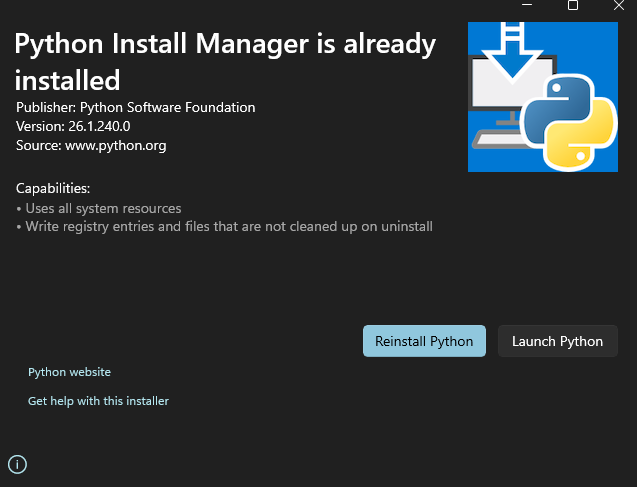
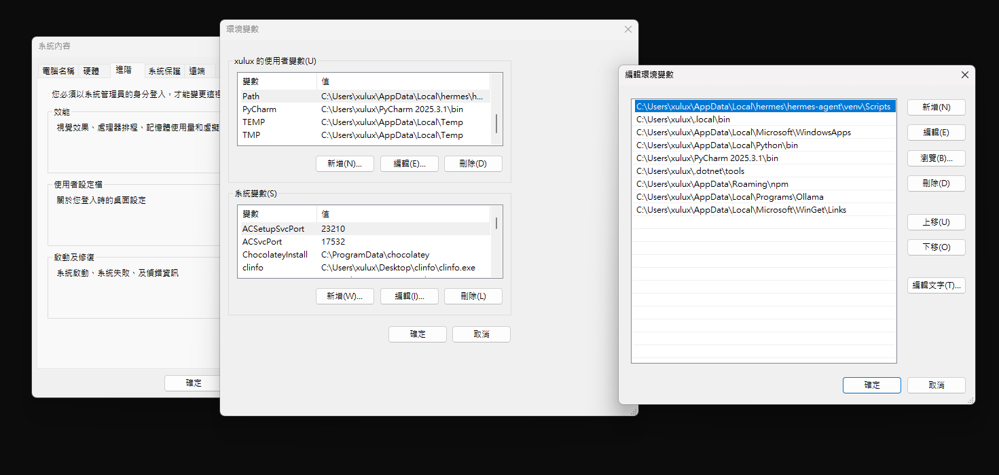
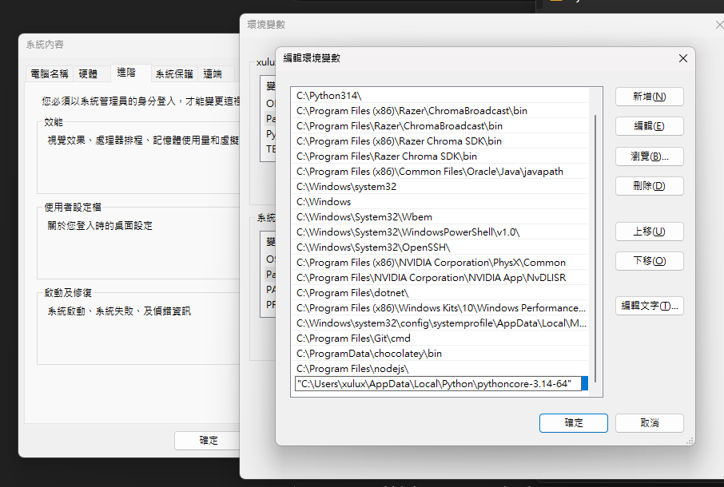

# Hermes-setting-error

## Introduction
This is my 11th grade student portfolio.

---

## [Error-1](error-1) : Python version mistake

### Problem
My Python version is **3.10**, but the project requires **Python 3.11 or higher**.

---

### Solution
Upgrade Python to version 3.11 or above.

Download :

---

## [Error-2](error-2) : still mistake

### Problem
After upgrading Python, the error still persisted due to incorrect system PATH settings.

---

### Solution
Added the correct Python path to the system environment variables.

---

## [Error-3](error-3) : Environment Setup Mistake

### Problem
Even after fixing the PATH, the issue remained due to incorrect Python environment usage.

---
 
### Solution
check python version (path correct or not) :

    PS C:\Users\xulux> where python
    PS C:\Users\xulux> py -0
     -V:3.14 *        Python 3.14.2
     -V:3.10          Python 3.10 (64-bit)

setting venv:

    PS C:\Users\xulux> cd C:\Users\xulux\AppData\Local\hermes\hermes-agent
    PS C:\Users\xulux\AppData\Local\hermes\hermes-agent> py -3.14 -m venv venv
    PS C:\Users\xulux\AppData\Local\hermes\hermes-agent> venv\Scripts\activate

[Pip-install](pip-install)
---

## [Hermes download success](hermes-download-success)

---

## Hermes setting

[choice Function](choice-function)
