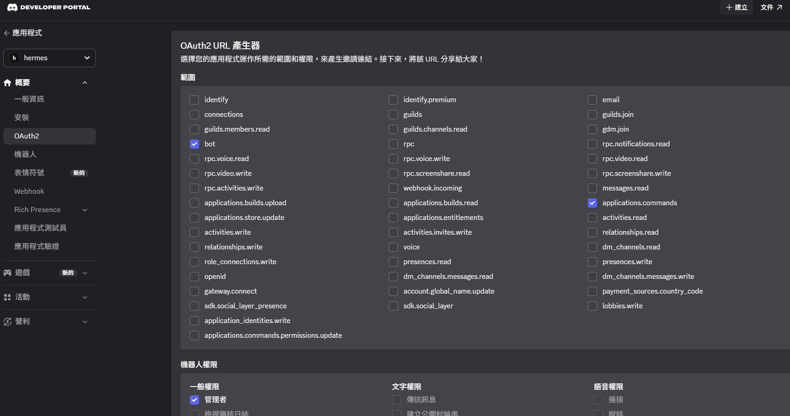

# Hermes-setting-error

## Introduction
This is my 11th grade student portfolio.

---

## [Error-1](error-1) : Python version mistake

### Problem
My Python version is **3.10**, but the project requires **Python 3.11 or higher**.

---

### Solution
Upgrade Python to version 3.11 or above.

Download :

---

## [Error-2](error-2) : still mistake

### Problem
After upgrading Python, the error still persisted due to incorrect system PATH settings.

---

### Solution
Added the correct Python path to the system environment variables.

---

## [Error-3](error-3) : Environment Setup Mistake

### Problem
Even after fixing the PATH, the issue remained due to incorrect Python environment usage.

---
 
### Solution
check python version (path correct or not) :

    PS C:\Users\xulux> where python
    PS C:\Users\xulux> py -0
     -V:3.14 *        Python 3.14.2
     -V:3.10          Python 3.10 (64-bit)

setting venv:

    PS C:\Users\xulux> cd C:\Users\xulux\AppData\Local\hermes\hermes-agent
    PS C:\Users\xulux\AppData\Local\hermes\hermes-agent> py -3.14 -m venv venv
    PS C:\Users\xulux\AppData\Local\hermes\hermes-agent> venv\Scripts\activate

[Pip-install](pip-install)
---

## [Hermes download success](hermes-download-success)

---

## Hermes setting

[choice Function](choice-function)

[test-1](test-1)

## Problem
If I input something it will disappear.

## Solution
#1 press Ctrl + C or Ctrl + L
     result : isn't work.
#2 open new PowerShell, and input " hermes " .
     it's work.
[Solution #2](sol-2)

--

[test-2](test-2)

## Problem
I input " hellow ", and it's error.
I don't have OpenRouter API key

## Solution
#1 [using ollama with gemma4 :e4b.](gemma4:e4b.)
     After test, I discover it is too slow.
          I think is my VRAM only 8 GB.
          
#2 I decide use Xiaomi MiMo.

   I choose [Xiaomi MiMo](MiMo-V2.5).
       The reason is that [Xiaomi MiMo](MiMo-V2.5) is not too slow and smart.

## [test](test-3)

## Problem 
I input " hi ", and it's error. 

---

## About a week ago, Ollama got an update and started supporting direct integration. So I decided to use its built-in commands instead.

# First : Download ollama in wsl.
   Problem : Lack Unzip tools.
   Solution : install zstd in wsl
   
       sudo apt update
       sudo apt install zstd -y

   And reinstall

       curl -fsSL https://ollama.com/install.sh | sh

# Second : Link Hermes with discord
   creat a discord bot and setting
   

# [Test](test-4)

   Success !!
